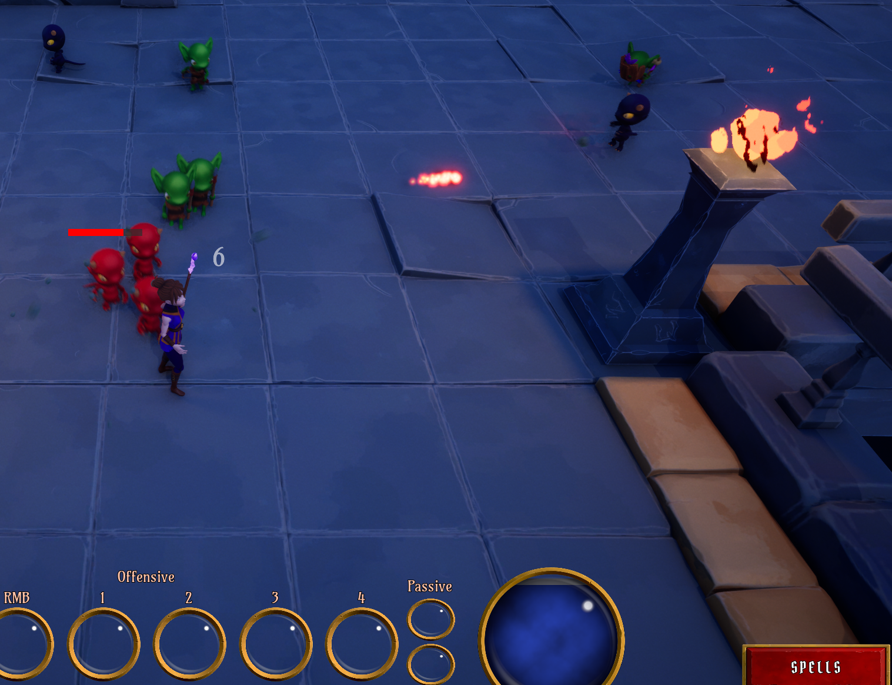

# Aura

Aura is a stylized Unreal Engine action RPG prototype built around the Gameplay Ability System. The project combines C++ gameplay architecture with Blueprint-authored abilities, enemies, UI, animation hooks, combat feedback, pickups, and dungeon content.

## Screenshots

| Combat HUD | Enemy Encounter |
| --- | --- |
|  |  |



## Features

- Gameplay Ability System integration for player and enemy characters
- Attribute sets, gameplay effects, damage execution, cooldowns, costs, XP, and level-up data
- Firebolt, summon, melee, ranged, hit reaction, and passive ability foundations
- Spell menu, attribute menu, overlay HUD, health, mana, XP, spell slots, and floating damage text
- Enemy AI built with Unreal StateTree, supported by EQS helpers and enemy class data
- Enhanced Input setup for movement, mouse targeting, and ability activation
- Dungeon combat space with enemy types, pickups, VFX, SFX, and Blueprint gameplay actors

## Technical Focus

The C++ layer owns the core gameplay systems: ability system setup, attributes, gameplay tags, damage calculations, ability helpers, widget controllers, input binding, projectiles, and combat interfaces. Blueprints are used for content assembly and iteration: abilities, gameplay effects, UI widgets, enemy variants, StateTree assets, maps, and data assets.

Enemy behavior is driven through Unreal StateTree instead of a purely hard-coded AI flow. This keeps combat behavior data-driven while still allowing C++ systems to provide reusable gameplay, targeting, and combat functionality.

## Requirements

- Unreal Engine 5.7
- Visual Studio 2022 or Rider with C++ toolchain support
- Windows development environment for the current project setup

The `.uproject` enables these Unreal modules/plugins:

- GameplayAbilities
- EnhancedInput
- UMG
- AIModule
- MotionWarping
- StateTree
- GameplayStateTree
- StateGraph

## Getting Started

1. Clone the repository.
2. Open `Aura.uproject` with Unreal Engine 5.7.
3. If prompted, rebuild missing modules.
4. Open the project in the editor and use the configured startup or dungeon maps from `Content/Maps`.

If IDE files are missing, regenerate project files from the `.uproject` context menu or from Unreal Editor.

## Repository Layout

```text
Config/              Project and gameplay tag configuration
Content/             Unreal assets, Blueprints, maps, VFX, SFX, UI, and data assets
Data/                Source data tables used by gameplay systems
Docs/Screenshots/    README screenshots
Plugins/             Project plugins
Source/              Aura C++ runtime module
```

## Generated Files

Unreal-generated folders such as `Binaries/`, `Intermediate/`, `Saved/`, and `DerivedDataCache/` are ignored for new files. They can be regenerated locally by Unreal Engine and should not be required to use the project.

## Notes

This project is gameplay-focused and currently under active development. Blueprint assets and C++ classes are expected to evolve together, especially around the Gameplay Ability System, character attributes, UI widget controllers, and enemy AI.
